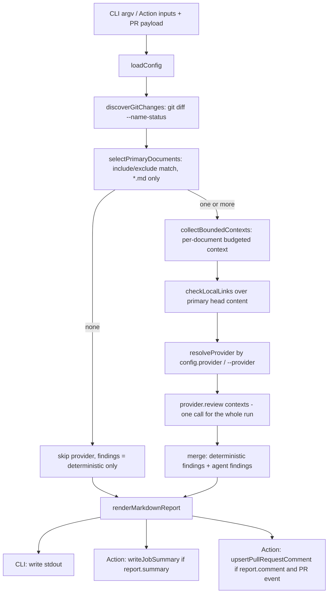

# Architecture

This document covers component boundaries and the end-to-end data flow. For config keys, CLI flags, and provider registration steps, see the [README](../README.md); this file goes one level deeper into how the pieces fit together and does not repeat that material.

## Component map

```
src/
  cli.ts              Entry point #1: parses argv, calls the orchestrator, writes stdout/stderr, sets exit code.
  action/index.ts      Entry point #2: reads Action inputs + @actions/github context, calls the orchestrator,
                        writes the job summary and/or upserts a PR comment, calls core.setFailed on error.
  orchestrator.ts      Wires everything below into one runScribeReview() call. The only module both entry points share.
  report.ts            Pure function: Finding[] -> Markdown report string. No I/O.
  github.ts            GitHub-specific I/O: job summary writer, sticky-comment upsert with fork fallback.
  core/
    config.ts          Loads + validates .scribe.yml (or an override path) against a strict zod schema.
    git-changes.ts      Runs `git diff --name-status --find-renames` and filters to "primary documents".
    git-text.ts          Runs `git show <ref>:<path>`, with repo-root path containment.
    context.ts           Builds one bounded PrimaryDocumentContext per primary document (uses git-text.ts).
    local-links.ts       Deterministic broken-relative-link check over primary documents' head content.
    findings.ts           The Finding schema + provider-response parsing shared by core and providers.
  providers/
    index.ts            Provider/ProviderRequest interfaces only — no implementation.
    copilot.ts            The only real Provider: shells out to the `copilot` CLI.
```

`src/core/index.ts` is a convenience re-export of core's public surface (`loadConfig`, `collectBoundedContexts`, `findingSchema`, `parseProviderFindingsResponse`, `discoverGitChanges`, `selectPrimaryDocuments`, `checkLocalLinks`); it is not an enforced import boundary. Nothing in `src/` actually imports through it — `orchestrator.ts` imports each `core/*` module directly (`./core/config.js`, `./core/context.js`, `./core/git-changes.js`, `./core/git-text.js`, `./core/local-links.js`), and both `report.ts` and `providers/*.ts` import `core/findings.js` directly. The barrel exists for external/library-style consumption of this package, not to gate internal access.

## Data flow



## Step-by-step

1. **Resolve inputs.** The CLI parses `--base`/`--head`/`--config`/`--provider` from argv. The Action reads its `provider`/`config`/`base`/`head`/`github-token` inputs and, if `base`/`head` weren't given explicitly, falls back to `pull_request.base.sha`/`pull_request.head.sha` from the Actions event payload.
2. **Load config.** `loadConfig` reads `.scribe.yml` (or the given path) if it exists, parses it as YAML, and validates it with a `zod` `.strict()` schema — unknown keys and non-positive `maxFiles`/`maxBytes` throw immediately, before any git or provider work happens. A missing file silently uses built-in defaults.
3. **Discover changes.** `discoverGitChanges` runs one `git diff --name-status --find-renames <base> <head> --` and parses each line into a `GitChange { status, path, oldPath? }`, sorted case-insensitively by path.
4. **Select primary documents.** `selectPrimaryDocuments` keeps only changes whose path ends in `.md`, matches at least one `include` glob, and matches no `exclude` glob (via `minimatch`, `dot: true`). These are the documents that get reviewed; everything else is only ever *context* for them.
5. **Short-circuit on no Markdown changes.** If there are zero primary documents, `runScribeReview` returns immediately with `contexts: []`, `deterministicFindings: []`, `agentFindings: []` — the provider is never invoked, so a PR that doesn't touch Markdown costs nothing.
6. **Assemble bounded context.** For each primary document, `collectPrimaryContext` (inside `context.ts`):
   - Reads the document's content at `baseRef` (using `oldPath` if the file was renamed) and at `headRef` via `git show <ref>:<path>`.
   - Admits `primary-head` and `primary-base` into the context first, each counted against that document's own `maxFiles`/`maxBytes` budget (budgets are **not** shared across primary documents).
   - If room remains, admits, in order: other changed Markdown files (`changed-markdown`), other changed non-Markdown files (`changed-file`, e.g. the source a doc describes), Markdown files linked from the base/head content via `[text](relative.md)` syntax and resolved relative to the document's directory (`linked-markdown`), and the nearest `README.md`/`index.md` found by walking up parent directories (`nearby-markdown`).
   - Every candidate path is resolved against `repoRoot` and rejected if it would escape it (`resolveRepoPath` throws on `..` traversal); anything matching the secret-filename heuristic (see [`security.md`](security.md)) is skipped unconditionally, before the budget check even runs.
   - A candidate that would exceed `maxFiles` stops the loop entirely; one that would exceed `maxBytes` is skipped, but the loop keeps trying later (smaller) candidates.
7. **Run the deterministic check.** `checkLocalLinks` runs over the **head** content of primary documents only — independent of step 6's budget, so a link-check finding is never lost just because the file didn't fit in the LLM-facing context. It flags any relative Markdown link whose target doesn't exist on disk (or resolves outside the repo) as a `broken-link`/`error`/`confidence: 1` finding with `source: "deterministic"`.
8. **Resolve and invoke the provider — only if there's at least one primary document.** `resolveProvider` picks an injected provider from the `providers` map if present (used by tests), else `"copilot"` maps to `createCopilotCliProvider`, else any other name throws `Unsupported provider: <name>` (a technical failure, not a finding). The provider's `review()` is called **once**, with every primary document's context passed together in one `contexts` array.
9. **Parse and validate the provider response.** `parseProviderFindingsResponse` unwraps an optional ` ```json ` fence, `JSON.parse`s the body, and validates it against `findingsResponseSchema` (a strict `{ findings: Finding[] }`). The Copilot provider additionally asserts every finding's `source` is `"agent"`. On any of these failing, it retries once with the validation error folded into a correction prompt; a second failure raises a real `Error`.
10. **Merge findings.** `result.findings = [...deterministicFindings, ...agentFindings]` — deterministic findings always sort first.
11. **Render.** `renderMarkdownReport` is a pure function producing one Markdown string: a header, `Total findings`/`Errors`/`Warnings`/`Info` counts, then one `##`-level section per finding with its severity/category, and HTML-escaped `<code>`-wrapped evidence/explanation/suggestion/source.
12. **Deliver.** The CLI writes the report to stdout and exits `0`. The Action writes it to the job summary if `config.report.summary`, and if `config.report.comment` and the run has a PR number, upserts a sticky comment (see [`security.md`](security.md) for the fork-token fallback). Any thrown error at any step above sets the CLI's exit code to `1` (message on stderr) or calls `core.setFailed(message)` in the Action — content findings never do either.

## Build-time boundary

`src/**/*.ts` is compiled by `tsc -p tsconfig.build.json` into `dist/**/*.js` (used by the `scribe` bin and by `src/cli.ts`'s module resolution), and `src/action/index.ts` is additionally bundled standalone by `@vercel/ncc` into `dist/action/index.js` (the file `action.yml`'s `runs.main` points at), since the Action runtime has no `node_modules` to resolve against at run time. Both artifacts are produced by `npm run build` (`scripts/build.mjs`) and are committed to git.
